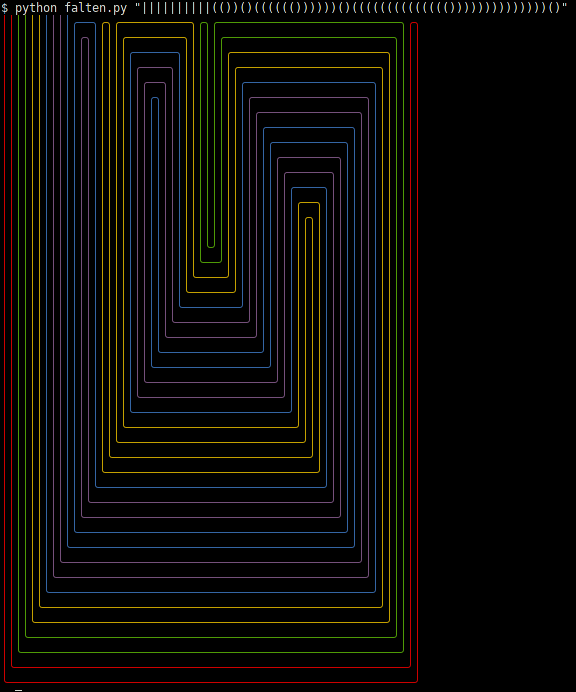

# falten



To customize color plate pass string of colors:
```bash
python falten.py -p "cyan magenta blue" "||.||().||.||()||()"
```

To turn off coloring pass empty strring for color plate:
```bash
python falten.py -p "" "||.||().||.||()||()"
```

For available colors look at: github.com/dslackw/colored
